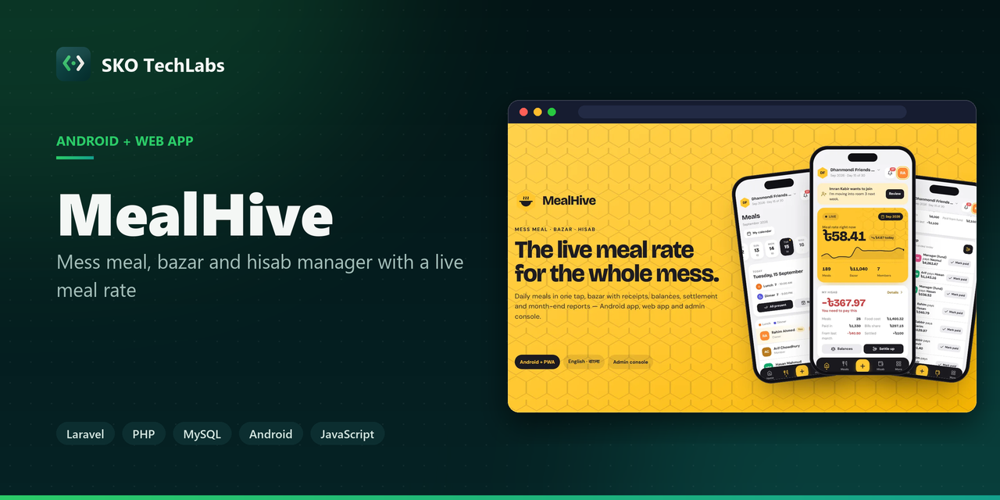
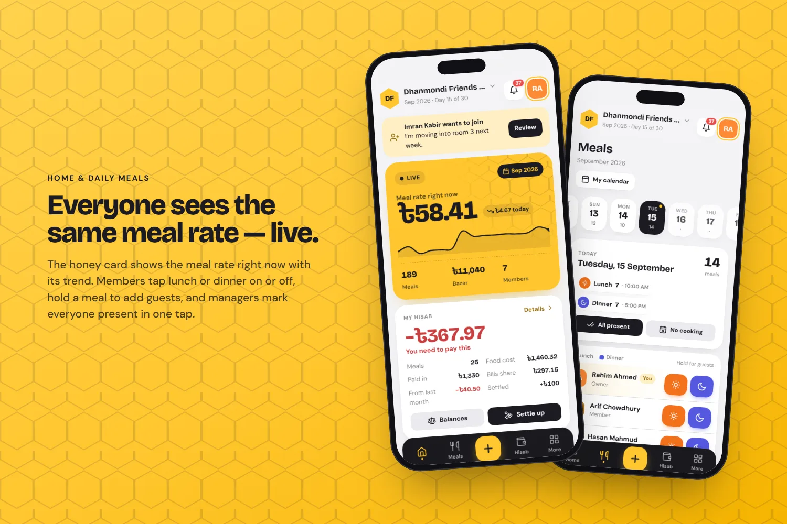
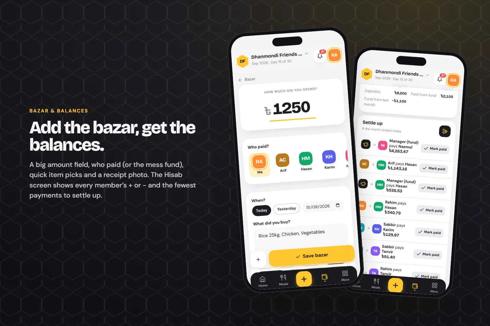
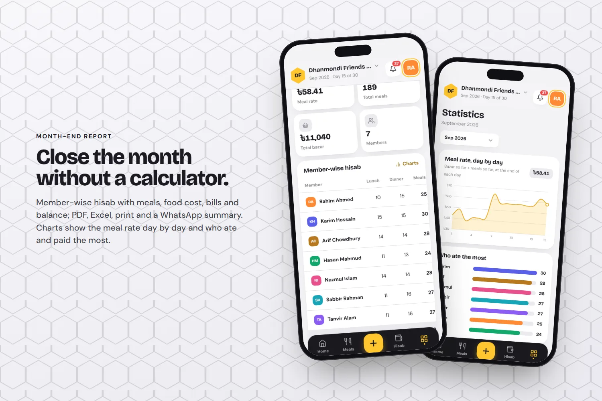
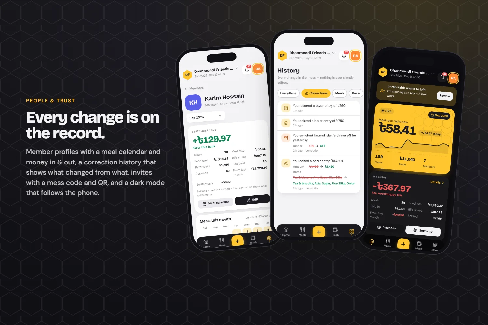
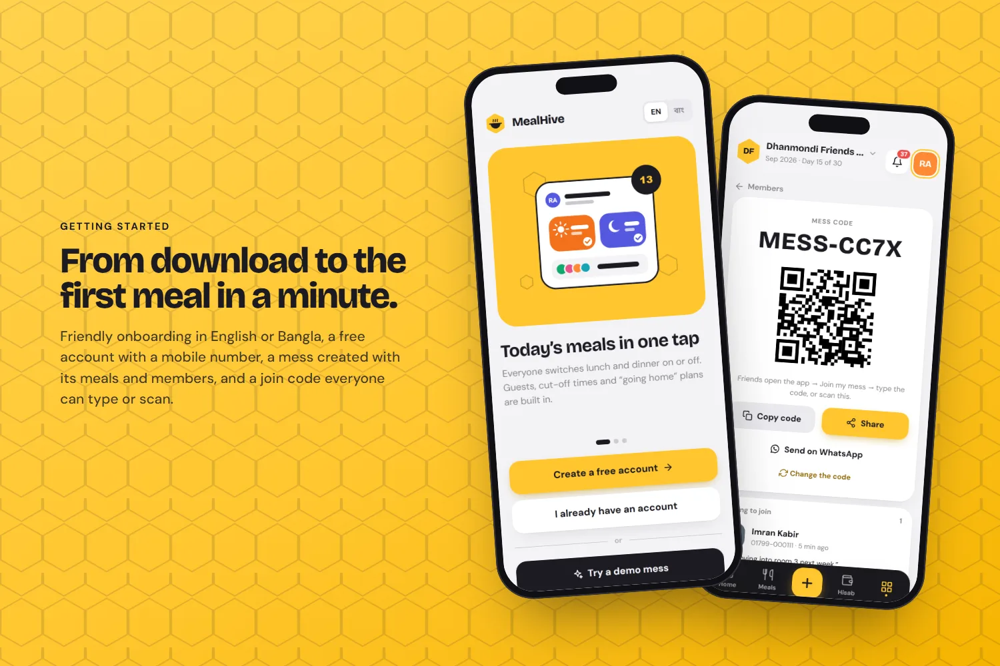
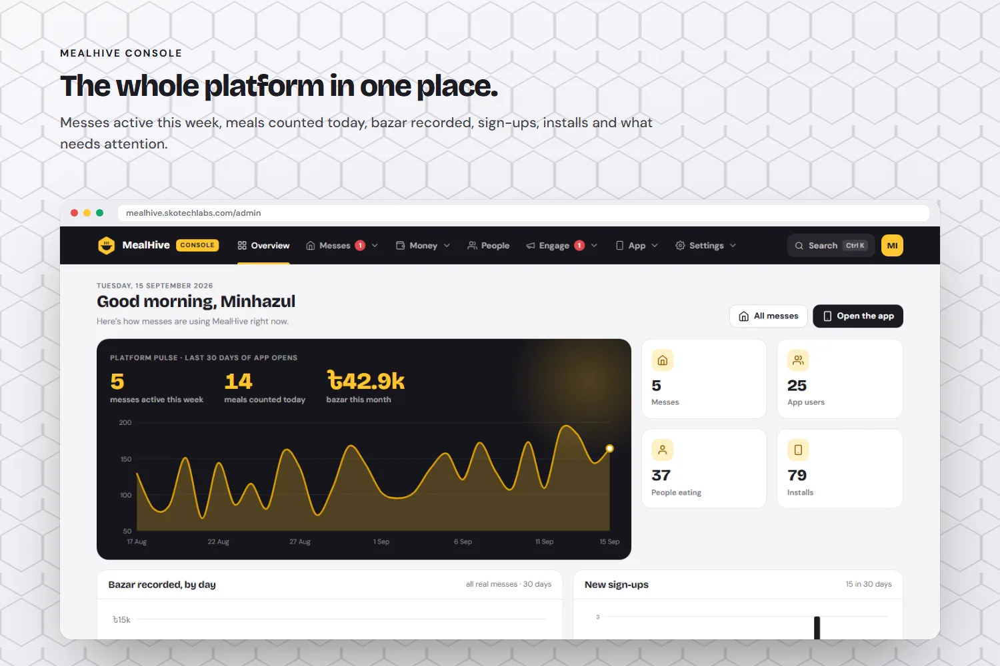
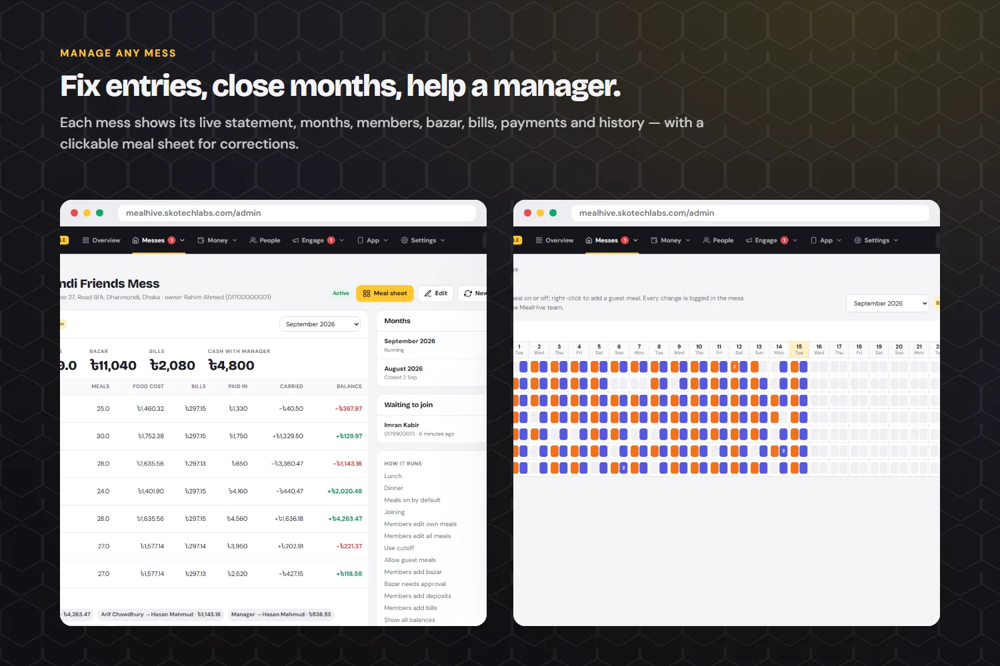
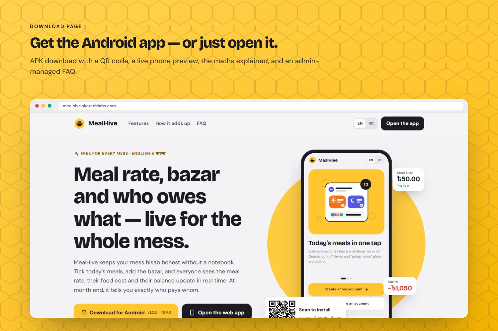

<h3>Mess meal, bazar and hisab manager with a live meal rate</h3>

An Android and web app for shared messes and bachelor houses: one-tap daily meals, bazar with receipts, a live meal rate, member balances, fair settlement and month-end PDF or Excel reports — with an admin console that manages everything.

   

<a href="https://mealhive.skotechlabs.com"><b>Live Demo</b></a> &nbsp;·&nbsp; <a href="https://skotechlabs.com/projects/mealhive-mess-meal-manager-app"><b>Case Study</b></a> &nbsp;·&nbsp; <a href="https://skotechlabs.com/contact"><b>Request a Demo</b></a> &nbsp;·&nbsp; <a href="https://github.com/skotechlabs"><b>All Products</b></a>

---

## Overview

MealHive replaces the meal notebook that almost every mess in Bangladesh keeps. Members switch today's lunch and dinner on or off in one tap (guest meals and away plans included), whoever shops adds the bazar with an optional photo of the memo, and everyone instantly sees the same meal rate — total bazar divided by total meals — together with their own food cost and balance.

The hisab is exact to the paisa: food cost is split by each member's meals, shared bills such as rent, gas, internet or the maid are split equally, deposits to the manager and payments between members are recorded, and the app lists the fewest payments needed to settle up. At month end the manager closes the month, balances carry forward automatically and the report can be exported as PDF or Excel, printed or shared on WhatsApp. Every change is kept in a correction history, and the screens refresh live for the whole mess.

It works in English and Bangla as an installable web app and as an Android app with background notifications. The MealHive Console lets the team manage every mess, member, bazar entry, bill, payment and month, fix a meal sheet, approve join requests, publish announcements and Android releases, edit the download page and control app-wide settings with staff roles.

<table>
<tr>
<td width="50%" valign="top">

### The Challenge

Messes in Bangladesh still run their monthly hisab in a notebook: meals are ticked by hand, bazar slips get lost, the meal rate is recalculated on a phone calculator and month-end settlement often ends in arguments. The app had to be simple enough for seven friends to use every day on basic Android phones, exact enough that nobody loses a taka to rounding, transparent about every change, and manageable by a small team without a developer.

</td>
<td width="50%" valign="top">

### Our Solution

We built a server-rendered Laravel app with a small, fast honey-and-ink interface designed for one-handed use, backed by a ledger that stores all money in paisa and splits food costs with a largest-remainder method so the totals always match. Automatic daily meals, cut-off rules and away plans remove most of the daily work, a live refresh keeps every phone in sync, and a correction history records who changed what. Months close with carried balances and a frozen report, exports are generated on the server with proper Bangla text shaping, and a thin Android shell adds background notifications, downloads, printing and sharing. The MealHive Console manages everything else.

</td>
</tr>
</table>

## Key Features

- Live meal rate (total bazar ÷ total meals) that updates for everyone the moment a meal or bazar changes
- One-tap daily lunch and dinner switches, guest meals, cut-off times, away plans and an automatic daily meal count
- Bazar entry with payer, items, quick picks and receipt photo, plus optional manager approval
- Member balances with food cost, shared bills split equally, deposits, refunds and member-to-member settlements
- Settle-up plan with the fewest payments, including cash held by the manager
- Month closing with carried balances, reopening, reports as PDF, Excel, print and WhatsApp summary
- Statistics: meal rate history, meals per day, bazar per day and who contributed
- Mess code and QR invites, join approval, roles (owner, manager, member) and members without smartphones
- Correction history with before and after values, notifications and a live refresh on every screen
- English and Bangla, light and dark themes, installable PWA and an Android app with background notifications
- MealHive Console: messes, members, meal sheet, bazar, bills, payments, months, announcements, help centre, Android releases, settings and staff roles

## Business Impact

- A mess can go from sign-up to its first counted meal in about a minute
- Balances always add up to the cash the manager holds, so settlement squares everyone exactly
- Month-end reports in PDF and Excel without a calculator
- Every correction visible to the whole mess, ending disputes with facts
- One codebase serving Android, the web and the admin console

## Screenshots

<table>
<tr>
<td width="50%" valign="top"> Home with the live meal rate, my hisab and one-tap daily meals</td>
<td width="50%" valign="top"> Adding bazar and the member balances with the settle-up plan</td>
</tr>
<tr>
<td width="50%" valign="top"> Month-end report with exports and meal rate statistics</td>
<td width="50%" valign="top"> Member profile, correction history and dark mode</td>
</tr>
<tr>
<td width="50%" valign="top"> Onboarding and inviting members with a mess code and QR</td>
<td width="50%" valign="top"> MealHive Console overview across all messes</td>
</tr>
<tr>
<td width="50%" valign="top"> Managing one mess: statement, months and the meal sheet</td>
<td width="50%" valign="top"> Download page with the Android APK and a live app preview</td>
</tr>
</table>

> See it running: **[mealhive.skotechlabs.com](https://mealhive.skotechlabs.com)**

## Technology Stack

## Source Code & Licensing

This repository is the public showcase for **MealHive**. The production source code is proprietary and is maintained privately by SKO TechLabs.

Interested in this product for your business? We offer:

- **Ready-to-launch deployment** of MealHive under your own brand and domain
- **Customisation** of features, workflows, languages and integrations to fit how you work
- **Custom development** of a new product built on the same foundations
- **Ongoing support**, hosting, maintenance and feature roll-outs after launch

## Get in Touch

---

© 2026 <a href="https://skotechlabs.com">SKO TechLabs</a> · Dhaka, Bangladesh · Building intelligent digital solutions

